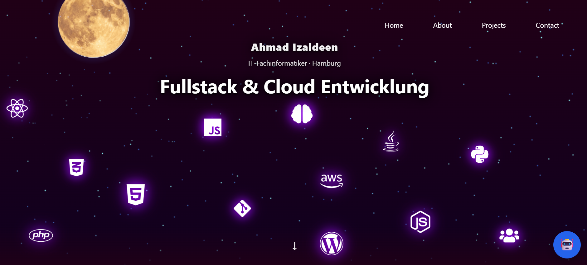
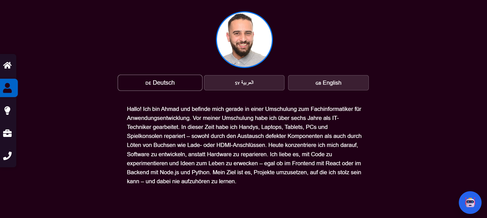
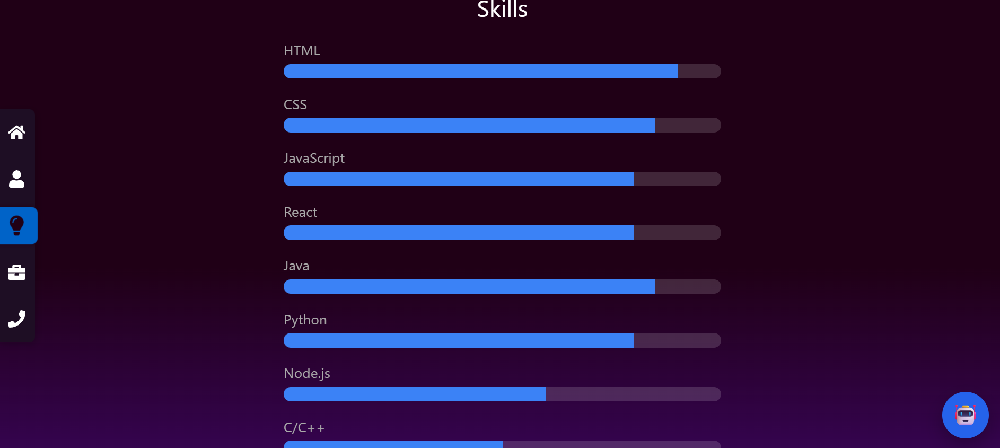
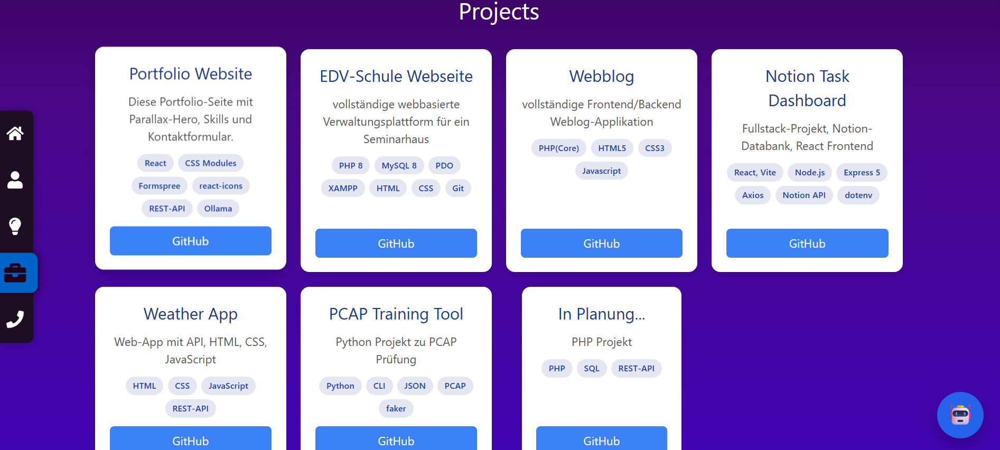
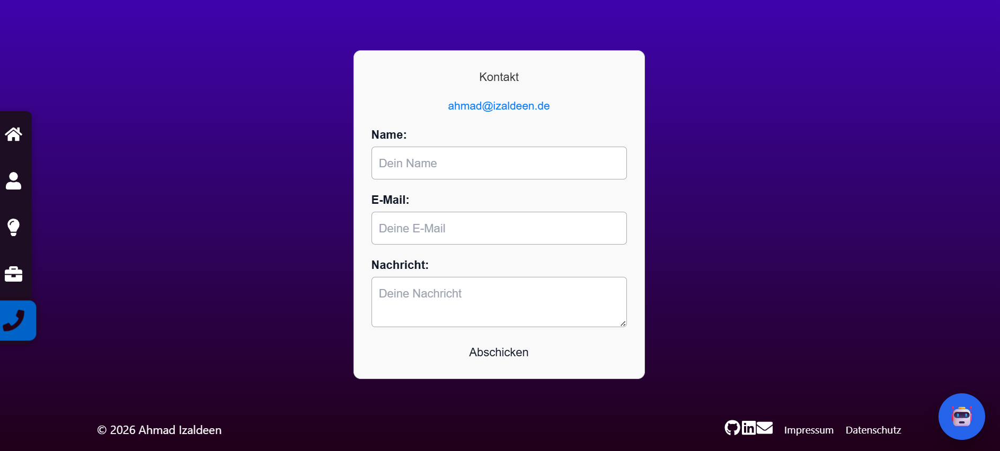

# Ahmad Izaldeen – Portfolio

Persönliches Portfolio als React-Webanwendung.

---

## Tech-Stack

- **React 19** (Create React App)
- **CSS Modules** für Komponenten-Styling
- **Tailwind CSS** für globale Utilities
- **react-icons** für Icons
- **Formspree** für das Kontaktformular
- **Ollama** für den KI-Chatbot
- **GitHub Pages** für das Deployment

---

## Sections

| Section | Beschreibung |
|---|---|
| Hero | Parallax-Hintergrund mit animierten Tech-Icons |
| Über mich | Dreisprachig – Deutsch, Arabisch, Englisch |
| Skills | Animierte Fortschrittsbalken mit Intersection Observer |
| Projekte | Eigene Projekte mit GitHub-Links und Tech-Tags |
| Kontakt | Formular via Formspree mit Status-Feedback |
| Footer | Social Links, Impressum & Datenschutz als Dark-Modal |
| ChatBot | Floating KI-Assistent powered by Ollama |

---

## Screenshots

<h3>Hero</h3>


<p>
Parallax-Hintergrund mit animierten Tech-Icons für einen modernen Einstieg.
</p>

---

<h3>Über mich</h3>


<p>
Mehrsprachige Darstellung in Deutsch, Arabisch und Englisch.
</p>

---

<h3>Skills</h3>


<p>
Animierte Fortschrittsbalken mit Intersection Observer.
</p>

---

<h3>Projekte</h3>


<p>
Eigene Projekte mit GitHub-Links und verwendeten Technologien.
</p>

---

<h3>Kontakt</h3>


<p>
Kontaktformular über Formspree inklusive Status-Feedback.
</p>

---

<h3>Footer</h3>

<p>
Social-Media Links, Impressum und Datenschutz im Dark-Modal.
</p>

---

<h3>ChatBot</h3>


<p>
Floating KI-Assistent auf Basis von Ollama.
</p>

---

---

## Projektstruktur

```
src/
├── components/
│   ├── Hero/            # Parallax Hero + Tech-Icons
│   ├── Navbar/          # Navigation + SideNavbar
│   ├── About/           # Mehrsprachiger Über-mich-Text
│   ├── Skills/          # Animierte Skill-Balken
│   ├── Projects/        # Projekt-Cards im Grid
│   ├── ContactForm/     # Kontaktformular (Formspree)
│   ├── Chatbot/         # Floating KI-Chat-Widget
│   ├── Footer/          # Footer + Impressum/Datenschutz Modal
│   └── ProfilePhoto/    # Profilbild-Komponente
├── pages/
│   └── legal/           # Impressum.jsx, Datenschutz.jsx
├── hooks/               # useContactForm, useChat
├── services/            # ollamaClient
└── styles/              # Globale Styles
```

---

## Lokale Entwicklung

```bash
npm install
npm start
```

### ChatBot einrichten

Der Chatbot benötigt eine lokal laufende [Ollama](https://ollama.com)-Instanz.

```bash
# Ollama installieren und ein Modell laden
ollama pull llama3

# Ollama starten (läuft standardmäßig auf Port 11434)
ollama serve
```

Konfiguration per Umgebungsvariablen (`.env`):

```env
REACT_APP_OLLAMA_URL=http://localhost:11434
REACT_APP_OLLAMA_MODEL=llama3
```

> ℹ️ Ohne laufende Ollama-Instanz zeigt der Chatbot eine Fehlermeldung an. Das restliche Portfolio funktioniert weiterhin normal.

---

## Deployment

```bash
npm run deploy
```

Deployed automatisch auf GitHub Pages via `gh-pages`.

---

## Status & Roadmap

### ✅ Abgeschlossen
- Hero mit Parallax + animierten Tech-Icons
- Über-mich Sektion (DE / AR / EN)
- Skills mit animierten Fortschrittsbalken
- Projekte-Grid mit GitHub-Links
- Kontaktformular via Formspree
- Footer mit Social Links (GitHub, LinkedIn, E-Mail)
- Impressum & Datenschutz als dunkle Modal-Popups (DSGVO-konform)
- **KI-Chatbot** als Floating Widget via Ollama


---

## Kontakt

📧 [ahmad@izaldeen.de](mailto:ahmad@izaldeen.de)
🐙 [github.com/Ahmadizaldeen](https://github.com/Ahmadizaldeen)
💼 [linkedin.com/in/ahmad-izaldeen](https://www.linkedin.com/in/ahmad-izaldeen)
